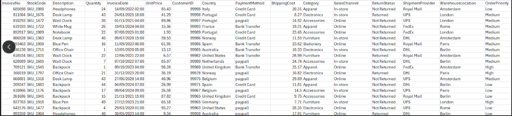
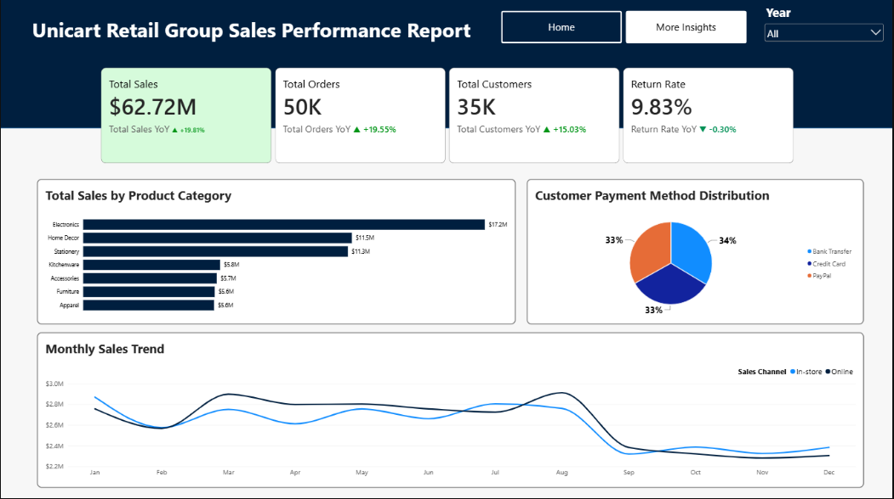

# Unicart Retail Group Sales Performance Report (2020 - 2025)

## Executive Summary
This analysis evaluates Unicart Retail Group’s sales performance from 2020 - 2025. It identifies patterns in monthly sales trends, provides insights into sales performance by product category and sales method and highlights key growth drivers as well as areas of concern such as sales, orders, customers and return rates.

## Business Context
Unicart Retail Group’s management requires clear, data-driven reporting of their sales performance at the transaction level. The objective is to understand performance in order to identify areas of growth and optimize operations.

## Objectives
This report addresses the following key questions:
- What are the Key Performance Indicators (KPIs), and how have they changed over the years?
- Which product categories and geographical locations are driving sales, and which are lagging behind?
- What are the preferred payment channels for customers?

## Data Overview
The analysis is based on a consolidated dataset of approximately 50,000 transactions and 16 columns, covering January 2020 to September 2025. It represents customer orders across all current operating locations.

## Data Preview

## Key Findings
- Average annual sales are approximately $11M.
- The total revenue for the business revolves around the same $11M cap which indicates that the business revenue isn’t growing. 
- Products in the Electronics category significantly contributed more to sales than other categories.
- Customer preference for payment methods is balanced, with nearly equal distribution among Credit Card, Bank Transfer and PayPal.

## Dashboard

## Link to Power BI Report
Click the link to access the full Power BI Report: [Click Here](https://app.powerbi.com/view?r=eyJrIjoiYmU1MzNiNDgtY2RkYy00MTA5LThmNGMtNjExNWUyYjE4NTEzIiwidCI6IjZjNzQ3Mzg1LTUyNTktNDcwMS05MTkzLTc5ZTkxNWNlYjA3ZSJ9)

## Data Cleaning and Transformation
- Removed duplicate entries from the entire dataset.
- Identified and handled approximately 3,000 null values from the Warehouse Location and also the ShippingCost column.
- Corrected and standardized the Product Category column using merge query.
- Standardized the Payment Method column by renaming “paypall” to “PayPal.”

## Detailed Findings & Analysis
### Key Performance Indicators (YoY Change)
- Total sales exceeded $62M during the review period.
- Average annual sales are approximately $11M.
- Sales over the years remain stagnant as there is no record of significant changes in the business revenue. 
- The return rate, which increased by 7.8% in 2023, has since declined consistently, reaching -0.3% as of September 2025.

### Total Sales by Product Category
- Electronics consistently outsell all other product categories. In 2025, sales reached $2M, exceeding second placed Stationery by $700K.
- Home Decor and Stationery pulled in revenue consistently at 2nd and 3rd  place and they alternated between both positions across the years.

### Customer Payment Method Distribution
- Customer payment preferences are closely balanced: Credit Card (33%), Bank Transfer (34%), and PayPal (33%).
- This pattern has remained consistent year over year, showing no significant dominance of one payment method.

### Monthly Sales Trend
- In-store and online sales trends slightly vary across the years. The variation is minimal.
- In 2021 and 2023, in-store sales dipped slightly in April and in subsequent years, in-store sales did reasonably well in April.
- In 2025, both channels moved in the same direction with minimal variation.
- Overall, both sales channels tend to move in the same direction with occasional minimal variation.

### Total Revenue by Country
- Sales across countries are closely aligned, with no significant outliers.
- In 2025, Norway recorded the highest sales ($703K), followed by Belgium ($695K). Australia recorded the lowest at $551K.
- This pattern of closely clustered sales values has remained consistent over the years.

## Recommendations
- Continue implementing policies introduced in 2024, which have successfully reduced the high return rate recorded in 2023.
- Promote products in Apparel, Furniture, Kitchenware and Accessories categories, as they consistently underperform compared to others. Increased promotions and visibility will be beneficial.

## Tools Used
- **Power Query:** Data cleaning and transformation
- **Power BI:** Data analysis and visualization

## Conclusion
Unicart Retail Group’s revenue has been stagnant over the past 5 years, with strong contributions from the Electronics product category and balanced customer preferences across payment methods. While return rates have improved since 2023, underperforming product categories present clear opportunities for growth. Strengthening these areas will position Unicart Retail Group for sustained performance in the years ahead.

